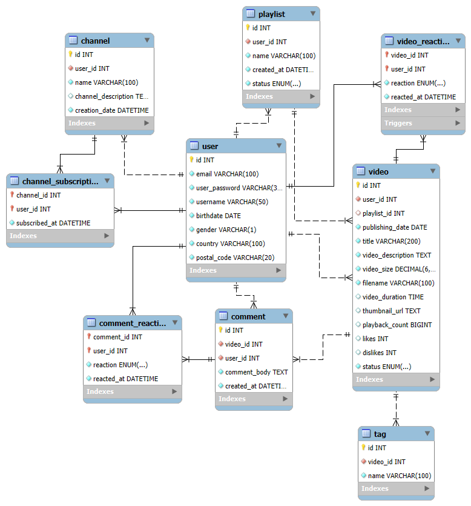

# 🎥 Nivell 2 — Exercici 1: YouTube

## 📄 Enunciat
Has estat contractat per dissenyar una **base de dades** per a una versió simplificada de **YouTube**.  
L’objectiu és modelar l’estructura que permetrà gestionar **usuaris**, **vídeos**, **canals**, **subscripcions**, **playlists**, **comentaris** i **reaccions**.

---

## 🧾 Requisits del sistema

### 👤 Usuaris
- Identificador únic  
- Email  
- Contrasenya  
- Nom d’usuari/ària  
- Data de naixement  
- Sexe (`M` o `F`)  
- País  
- Codi postal  

> 🔸 Cada usuari/ària pot pujar vídeos, crear canals, subscriure’s a altres canals, donar likes/dislikes i crear playlists personals.

---

### 🎬 Vídeos
- Identificador únic  
- Usuari/ària que publica el vídeo  
- Playlist associada  
- Data de publicació  
- Títol  
- Descripció  
- Mida  
- Nom de fitxer  
- Durada  
- Miniatura (`thumbnail`)  
- Nombre de reproduccions  
- Nombre de likes i dislikes  
- Estat (`PUBLIC`, `HIDDEN`, `PRIVATE`)

> 🔸 Un vídeo pot tenir **moltes etiquetes**, i cada etiqueta està identificada per un nom únic.  
> 🔸 Es guarda la data/hora en què es publica.

---

### 🏷️ Etiquetes
- Identificador únic  
- Vídeo associat  
- Nom de l’etiqueta (únic)

> Permeten classificar els vídeos segons el contingut.

---

### 📺 Canals
- Identificador únic  
- Usuari/ària propietari/ària  
- Nom  
- Descripció  
- Data de creació  

> 🔸 Cada usuari/ària pot tenir **un sol canal**.  
> 🔸 Altres usuaris/es poden **subscriure’s** al canal.

---

### 🔔 Subscripcions
- Canal al qual es subscriu  
- Usuari/ària que es subscriu  
- Data/hora de la subscripció  

> Un/a usuari/ària pot subscriure’s a molts canals, i cada canal pot tenir molts subscriptors.  
> La relació és de tipus **N:M**.

---

### 🧡 Reaccions a vídeos
- Vídeo associat  
- Usuari/ària que reacciona  
- Tipus de reacció (`LIKE` o `DISLIKE`)  
- Data/hora de la reacció  

> Un/a usuari/ària només pot reaccionar una vegada a cada vídeo.  
> Les **triggers** gestionen automàticament el recompte de likes i dislikes.

---

### 📜 Playlists
- Identificador únic  
- Usuari/ària propietari/ària  
- Nom  
- Data de creació  
- Estat (`PUBLIC` o `PRIVATE`)

> Cada usuari/ària pot tenir diverses playlists amb vídeos que li agraden.

---

### 💬 Comentaris
- Identificador únic  
- Vídeo associat  
- Usuari/ària que comenta  
- Text del comentari  
- Data/hora del comentari  

> 🔸 Els comentaris poden rebre likes o dislikes d’altres usuaris/es.  
> 🔸 Es guarda la data/hora de cada reacció.

---

### 👍 Reaccions a comentaris
- Comentari associat  
- Usuari/ària que reacciona  
- Tipus de reacció (`LIKE` o `DISLIKE`)  
- Data/hora  

---

## 🧱 Estructura de la base de dades

El model segueix una estructura **relacional normalitzada**, amb les següents taules principals:

| Taula | Descripció |
|--------|-------------|
| `user` | Usuaris/es registrats/des |
| `channel` | Canals associats a un usuari/ària |
| `channel_subscription` | Subscripcions entre usuaris/es i canals |
| `video` | Vídeos pujats pels usuaris/es |
| `tag` | Etiquetes associades als vídeos |
| `playlist` | Llistes de reproducció creades pels usuaris/es |
| `video_reaction` | Likes i dislikes de vídeos |
| `comment` | Comentaris als vídeos |
| `comment_reaction` | Likes i dislikes de comentaris |

---

## 🔗 Relacions entre taules

- **user → channel** → 1:1  
- **user → video** → 1:N  
- **user → playlist** → 1:N  
- **user → comment** → 1:N  
- **video → tag** → 1:N  
- **video → comment** → 1:N  
- **channel → channel_subscription → user** → N:M  
- **video → video_reaction → user** → N:M  
- **comment → comment_reaction → user** → N:M  
- **playlist → video** → 1:N (opcional)

---

## ⚙️ Triggers de control de reaccions

S’han definit tres **triggers** per mantenir actualitzats els comptadors de `likes` i `dislikes` a la taula `video`:
1. `trg_video_reaction_ai` — incrementa el comptador després d’un insert.  
2. `trg_video_reaction_au` — ajusta els comptadors després d’una actualització.  
3. `trg_video_reaction_ad` — decrementa el comptador després d’una eliminació.  

---

## 🧩 Diagrama relacional



---

## 🧰 Eines utilitzades

- 🐳 **Docker Desktop** — Contenidor MySQL 8.0  
- 💾 **MySQL Workbench 8.0** — Modelatge i execució de consultes  
- 🧩 **EER Diagram** — Exportat des de Workbench en format `.png`

---

## ⚙️ Script SQL utilitzat

Fitxer `youtube.sql` (fragment resumit):

```sql
CREATE DATABASE youtube;
USE youtube;
-- Creació de taules user, channel, video, playlist, tag, comment, comment_reaction, video_reaction, channel_subscription
-- Creació de triggers per a actualitzar likes/dislikes
```
---

## 📦 Fitxer `docker-compose.yml`

```yaml
version: "3.9"

services:
  db:
    image: mysql:8.0
    container_name: youtube-db
    environment:
      MYSQL_ROOT_PASSWORD: root
      MYSQL_DATABASE: YouTube
      MYSQL_USER: user
      MYSQL_PASSWORD: userpass
    ports:
      - "3307:3306"
    volumes:
      - db_data:/var/lib/mysql

volumes:
  db_data:
```
